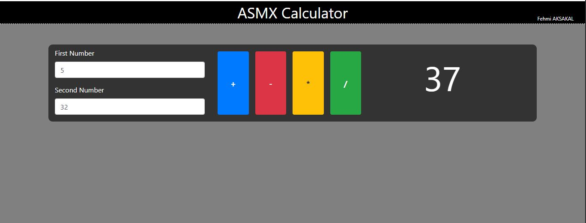

# ASMX CALCULATOR

This project have an ASMX web service and one Webform. The Webform take the value from client and send value to ASMX web service. ASMX web service process the value and return the solution to Webform. The WebFrom consumed the ASMX web service in this cycle.

* Plus
* Subtraction
* Multiply
* Divide

